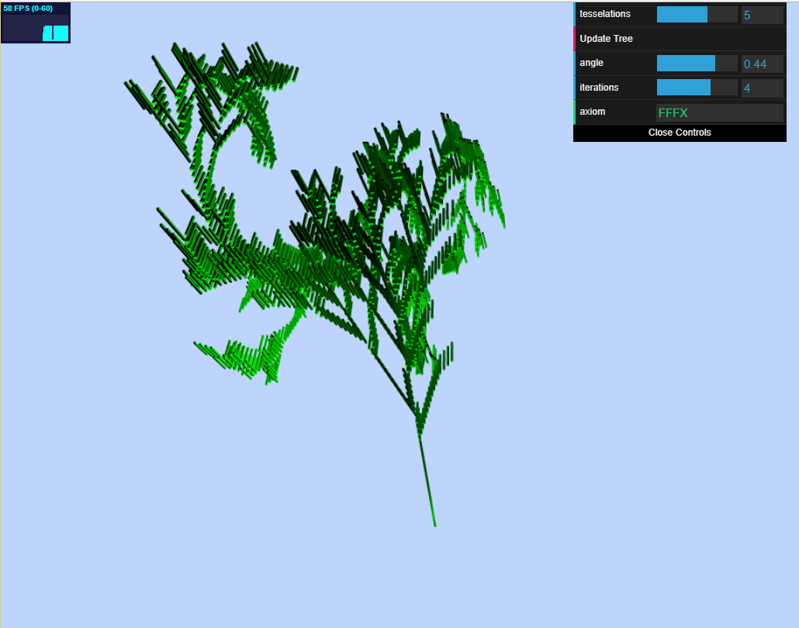

## READ-ME
PennKey: nmaga
Live demo link: https://nmagarino.github.io/homework-4-l-systems-nmagarino/

For my L-system I used a series of aligned primitive cube shapes to form a tree.  I modeled my initial grammar expansion rules from a fractal plant example I found on wikipedia (https://en.wikipedia.org/wiki/L-system), and edited it from there.  In terms of implementation, I started off my grammar expansion L system logic from the base code provided in the previous CIS700 Procedural Graphics course (https://github.com/CIS700-Procedural-Graphics/Project3-LSystems), and followed along some student implementations.  More specifically, the grammar rules are as such:
* "F" -> FF
* "X" -> FFF[+FXF>F+F]FX[-FFX-FX<]X[+F>XFFF+]X>XF (a lot)
* "X" -> does not affect turtle, only for expansion
* "F" -> draw a shape forward along direction vector of turtle
* "+" -> rotate turtle about z-axis by specified angle (positive)
* "-" -> rotate turtle about z-axis by specified angle (negative)
* ">" -> rotate turtle by angle along x (negative) OR y axis
* "<" -> rotate turtle by angle along x (positive) OR y axis

